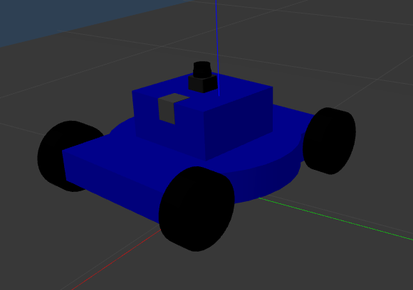
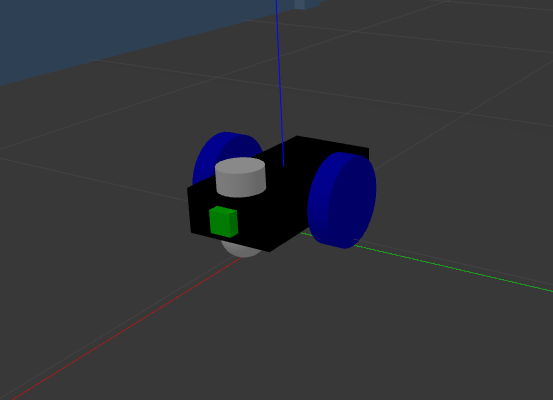

# Robotics Technology (254774)
# Assignment-01: Ros Robot Navigation. 

1. Custom environments in Gazebo:
   - floor size at least 500 square meters
   - at least 5 rooms
   - at least 20 furniture items (table, chair, plant pots, etc.)
   - other things as you can imagine
   
2. A mobile robot:
   - Differential drive (or omnidirectional drive-- extra points)
   - About 0.5 m (length) x 0.5m (width) x 1.0 (height) (Examples)
   
3. Map from Lidar sensor

4. Autonomous navigation capability

## Introduction

A 2D navigation stack that takes in information from odometry, sensor streams, and a goal pose and outputs safe velocity commands that are sent to a mobile base.

This repository contains a Robot Operating System (ROS) implementation of a differential and omnidirectional robot model for uses with the ROS navigation stack.
The model uses the Adaptive Monte Carlo localization (AMCL) algorithm  for localisation with the Dwa local planner method to navigate to goal locations.

 

## Prerequisites

1. [Ubuntu (melodic)](http://wiki.ros.org/melodic/Installation/Ubuntu) 

2. Robot Operating System (ROS). can be found [here](http://wiki.ros.org/ROS/Installation). (Version 1)

3. Install ROS nodes required for the local and global planners, amcl, maps and motor control for the navigation stack.

## Installing

Clone this repository in your workspace_name. (In "src" folder)

```sh
$ cd ~/workspace_name/src/
$ git clone https://github.com/Watanyu37/Ros-navigation.git
```

Build the project:
```sh
$ cd ~/workspace_name
$ catkin_make
```

The following line can be added to your .bashrc to auto-source all new terminals
```
source ~/workspace_name/devel/setup.bash
```

## Run the Code

In a terminal window, type the following, for differrential robot  
```sh
$ cd ~/workspace_name
$ roslaunch diff_gazebo diff_all_tags.launch
```
For omnidirectional robot
In a terminal window, type the following
```sh
$ cd ~/workspace_name
$ roslaunch skid_gazebo skid_all_tags.launch
```

Gazebo and Rviz will load and you should arrive at a result similar to the below.


###### Testing 

Navigate by 2D Nav Goal
1. In Rviz, click on the 2D Nav Goal in the top menu. 
2. Click on the Rviz map where you want the robot to navigate too. 

Navigate by python file.

You should arrive at a result similar to the below.


